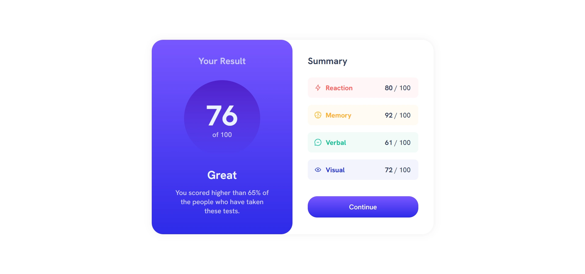

# Results summary component | solution to the Frontend Mentor challenge

This is a solution to the [Results summary component challenge on Frontend Mentor](https://www.frontendmentor.io/challenges/results-summary-component-CE_K6s0maV). Frontend Mentor challenges help you improve your coding skills by building realistic projects.

## Screenshot

## Links

- Live Site URL: (https://results-summary-km9.netlify.app)

## Built with

- HTML5
- SCSS
- Angular
- TypeScript

## Author

- Frontend Mentor - (https://www.frontendmentor.io/profile/k-malkiewicz)
- Codewars - (https://www.codewars.com/users/k_malkiewicz)